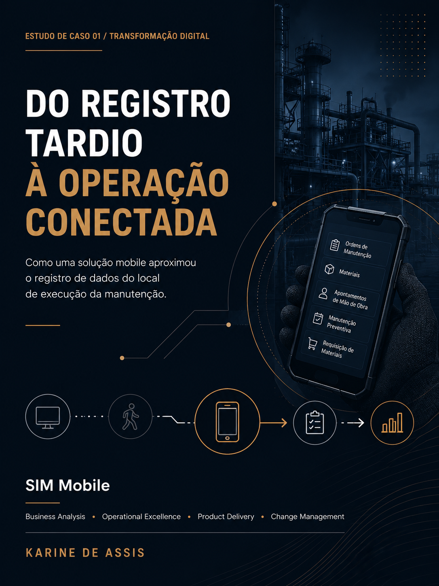

# SIM Mobile

## Da fricção operacional ao fluxo digital

O **SIM Mobile** foi uma iniciativa de transformação digital aplicada à manutenção industrial, criada para aproximar o sistema corporativo da rotina dos profissionais em campo.

O problema central não estava apenas no sistema ou nos indicadores. Estava no momento em que o dado era registrado.

Enquanto o trabalho acontecia no chão de fábrica, atividades importantes ainda dependiam de computadores fixos localizados em salas de apoio. Para consultar estoque, abrir ou atualizar ordens de manutenção, registrar horas de trabalho ou concluir atividades, os técnicos precisavam se afastar do local da execução.

Quando o acesso ao computador não era imediato, o registro das informações podia ser adiado até o final do turno. Assim, a fricção operacional e a baixa qualidade dos dados faziam parte do mesmo problema.

---

## Resumo executivo

O projeto teve como objetivo transformar etapas importantes da rotina de manutenção em fluxos acessíveis por dispositivos móveis.

A solução foi desenvolvida de forma incremental, começando pelas atividades que geravam maior atrito operacional e evoluindo após testes, validações e uso em campo.

Minha atuação ocorreu pelo lado do negócio, conectando a realidade da manutenção à equipe de Tecnologia da Informação.

---

## O problema

O processo anterior apresentava desafios como:

- dependência de computadores fixos;
- deslocamentos entre o chão de fábrica e as salas de apoio;
- espera por computadores disponíveis;
- atraso no registro das atividades realizadas;
- ordens de manutenção que permaneciam abertas por mais tempo;
- apontamentos de mão de obra realizados posteriormente;
- menor aderência entre os dados do sistema e a realidade operacional;
- dificuldade de obter informações confiáveis e tempestivas para análise.

### A cadeia oculta do problema

**Registro atrasado → apontamentos ausentes → ordens abertas → dados menos confiáveis → capacidade analítica limitada**

A operação acontecia, mas o sistema nem sempre refletia a realidade no mesmo momento.

---

## A solução

Foi desenvolvida uma solução mobile integrada ao sistema corporativo de manutenção.

O objetivo não era reproduzir integralmente o sistema utilizado nos computadores, mas disponibilizar no celular os fluxos mais importantes para a execução do trabalho em campo.

Ao longo da evolução do produto, foram disponibilizadas funcionalidades relacionadas a:

- manutenção corretiva;
- criação e atualização de ordens de manutenção;
- consulta de estoque;
- manutenção preventiva;
- consulta de apontamentos de mão de obra;
- requisição de materiais;
- registro de informações mais próximo do local da execução.

### Princípio de desenvolvimento

A solução foi orientada por uma pergunta simples:

> O que o técnico realmente precisa fazer enquanto está ao lado da máquina?

Essa abordagem ajudou a priorizar os fluxos de maior valor operacional.

---

## Minha atuação

Atuei como responsável pela condução da iniciativa pelo lado do negócio.

Não desenvolvi tecnicamente o software. Minha responsabilidade foi traduzir os processos de manutenção em requisitos funcionais, validar a solução e coordenar as atividades necessárias para que ela funcionasse no ambiente operacional real.

Minhas principais responsabilidades incluíram:

- identificação das principais dores operacionais;
- mapeamento da jornada dos usuários;
- levantamento das necessidades das equipes de manutenção;
- tradução dos processos operacionais em requisitos funcionais;
- definição de telas, fluxos e comportamentos esperados;
- priorização das funcionalidades;
- conexão entre as áreas de Manutenção e Tecnologia da Informação;
- acompanhamento do desenvolvimento;
- esclarecimento de dúvidas sobre os fluxos operacionais;
- execução de testes funcionais;
- identificação de erros e inconsistências;
- coordenação de correções com a equipe de TI;
- repetição dos testes após os ajustes;
- condução e acompanhamento do projeto-piloto;
- treinamento inicial da equipe de PCM;
- apoio à implantação;
- suporte à comunicação e à gestão da mudança;
- acompanhamento da liberação de acessos;
- apoio à adoção da solução pelas equipes.

---

## Jornada anterior

Antes da solução, uma atividade podia percorrer as seguintes etapas:

1. uma necessidade era identificada no chão de fábrica;
2. o técnico se afastava da máquina;
3. deslocava-se até uma sala de apoio;
4. aguardava um computador disponível;
5. acessava o sistema para consultar ou registrar informações;
6. retornava à área de produção.

Em alguns casos, o técnico conseguia reparar a máquina mais rapidamente do que concluir o processo administrativo relacionado ao serviço.

---

## Evolução do produto

A solução evoluiu de forma incremental, começando pelos fluxos de maior atrito e ampliando o escopo após validação.

| Período | Fase | Evolução |
|---|---|---|
| Março de 2021 | Modelagem e desenvolvimento | Estruturação e desenvolvimento inicial da solução mobile |
| Junho de 2021 | Fase 1 | Manutenção corretiva, criação de ordens e consulta de estoque |
| Dezembro de 2021 | Expansão | Manutenção preventiva e consulta de apontamentos de mão de obra |
| Novembro de 2022 | Novo fluxo | Requisição de materiais |

---

## Projeto em números

- **2021:** início da implantação;
- **5+ fluxos mobile:** disponibilizados ao longo da evolução;
- **148 usuários habilitados:** até outubro de 2022;
- **3 unidades brasileiras:** acompanhadas no escopo do projeto.

> Usuários habilitados não significam necessariamente usuários ativos. Os dados históricos disponíveis permitem comprovar a liberação dos acessos, mas não o uso diário de cada funcionalidade.

---

## Piloto e gestão da mudança

Uma solução tecnicamente funcional não gera valor se os usuários não a adotarem.

Por isso, o projeto incluiu um ciclo de validação em ambiente real:

**Desenvolver → Testar → Observar → Relatar problemas → Corrigir → Testar novamente**

O primeiro piloto foi realizado com equipes de manutenção elétrica e um escopo funcional limitado.

Durante essa etapa:

- erros técnicos e problemas de fluxo foram identificados em uso real;
- os pontos encontrados foram reportados à equipe de TI;
- as correções foram acompanhadas;
- a solução foi testada novamente antes de uma expansão mais ampla.

### Modelo de implantação

A expansão da solução envolveu etapas como:

1. autorização dos usuários;
2. preparação dos materiais de treinamento;
3. solicitação de acesso à rede Wi-Fi;
4. liberação do acesso ao sistema;
5. início do uso da solução mobile.

A equipe de PCM foi treinada inicialmente para depois apoiar as demais equipes de manutenção.

---

## Impacto observado

A implantação do SIM Mobile promoveu mudanças estruturais no processo:

- aproximou atividades importantes do sistema do local de execução;
- possibilitou registros mais próximos do momento em que o trabalho acontecia;
- reduziu a dependência de computadores localizados em salas de apoio;
- diminuiu etapas administrativas entre a execução e o registro;
- fortaleceu a integração entre a operação de manutenção e a área de tecnologia;
- criou uma base mais favorável para dados operacionais mais tempestivos;
- ampliou o potencial de uso das informações para análises e indicadores.

---

## Limitação analítica

Os registros históricos disponíveis acompanharam principalmente a habilitação de acessos e indicadores iniciais de adoção.

Esses dados não permitem afirmar, de forma isolada:

- a frequência de uso diário;
- o número de usuários ativos;
- a utilização de cada funcionalidade;
- o ganho financeiro gerado;
- a redução exata do tempo de execução;
- o aumento quantitativo da produtividade.

Por esse motivo, este case não atribui ao projeto resultados financeiros ou ganhos de produtividade que não possam ser comprovados.

---

## O que eu mediria em uma próxima fase

Uma etapa seguinte poderia conectar os dados de acesso, os eventos das ordens de manutenção e o desempenho das equipes para transformar os dados de implantação em inteligência de produto e de operação.

### Adoção

- usuários ativos mensais;
- conversão entre acesso habilitado e uso real;
- frequência de uso;
- taxa de adoção por funcionalidade;
- adoção por equipe e unidade.

### Eficiência operacional

- tempo para encerramento das ordens;
- percentual de ordens encerradas no mesmo turno;
- tempo entre a execução e o registro;
- participação do mobile em relação ao desktop;
- tempo gasto em etapas administrativas.

### Qualidade dos dados

- ordens sem apontamento de mão de obra;
- ordens abertas além do prazo esperado;
- envelhecimento das ordens abertas;
- taxa de registros realizados com atraso;
- percentual de ordens com informações incompletas.

### Impacto no negócio

- tempo produtivo dos técnicos;
- backlog de manutenção;
- correlação com o MTTR;
- disponibilidade dos equipamentos;
- comportamento dos indicadores antes e depois da adoção;
- relação entre uso da solução e desempenho das equipes.

---

## Principais aprendizados

### 1. Transformação digital começa pela fricção operacional

O ponto de partida não foi uma tecnologia específica. Foi um técnico precisando deixar a máquina para encontrar um computador.

### 2. Qualidade de dados começa antes do banco de dados

O problema não era inicialmente o dashboard. Era o momento e a forma como o dado era capturado.

### 3. Negócio e tecnologia precisam de tradução

A manutenção conhecia a dor operacional. A equipe de TI dominava a tecnologia. O projeto precisava conectar essas duas realidades.

### 4. A entrega não termina no lançamento

Testes, treinamento, comunicação, gestão de acessos, suporte e acompanhamento da adoção fizeram parte da jornada do produto.

### 5. A adoção precisa ser medida com cuidado

Acesso habilitado não é sinônimo de uso ativo. Uma análise madura precisa diferenciar liberação, adoção, frequência de uso e geração de valor.

---

## Competências demonstradas

Este projeto evidencia competências relacionadas a:

- transformação digital;
- análise de processos;
- business analysis;
- levantamento de requisitos;
- definição de requisitos funcionais;
- gestão de produto;
- product delivery;
- melhoria contínua;
- excelência operacional;
- gestão da manutenção;
- conexão entre negócio e tecnologia;
- testes funcionais;
- implantação de soluções;
- gestão da mudança;
- treinamento e adoção;
- análise de dados operacionais;
- pensamento analítico;
- definição de indicadores.

---

## Contexto profissional e confidencialidade

O projeto foi desenvolvido no contexto da manutenção industrial, com participação direta das áreas operacionais e de Tecnologia da Informação.

Por questões de confidencialidade, este case apresenta a estrutura do problema, da solução e da minha atuação sem expor:

- dados internos sensíveis;
- códigos ou informações técnicas proprietárias;
- documentos reservados;
- nomes de usuários;
- informações estratégicas da empresa.

---

## Próximas atualizações

Este repositório será complementado com:

- case completo em PDF;
- versão brasileira do case executivo;
- jornada visual do processo anterior;
- comparação entre o cenário anterior e o cenário posterior;
- arquitetura conceitual da solução;
- linha do tempo visual do projeto;
- principais telas e fluxos apresentados de forma não confidencial;
- materiais adicionais sobre indicadores e oportunidades analíticas.
