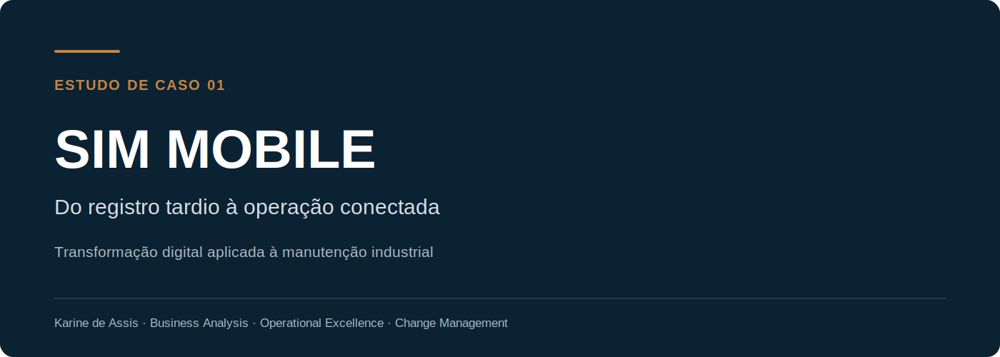
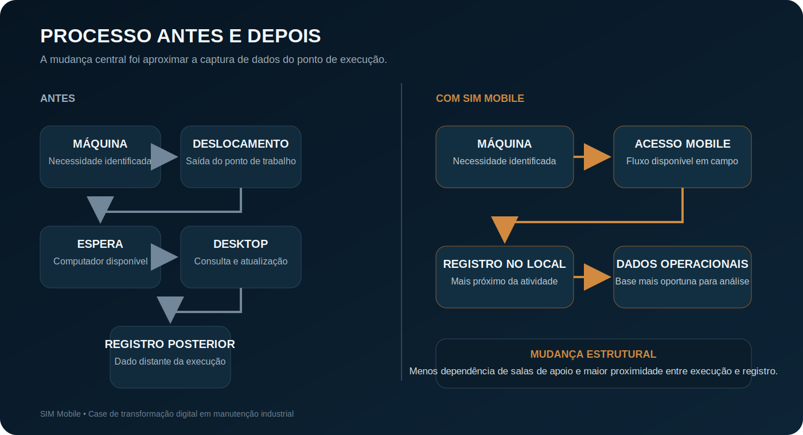
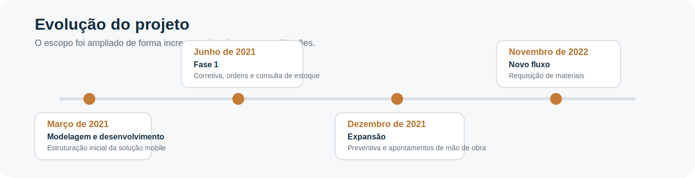

  

 

O **SIM Mobile** foi uma iniciativa de transformação digital aplicada à manutenção industrial. O projeto disponibilizou, em dispositivos móveis, atividades relevantes do sistema corporativo de manutenção para reduzir a dependência de computadores fixos e aproximar o registro das informações do local de execução do trabalho.

## Documentação

- [Estudo de caso em português](CASE_STUDY_PT.md)
- [Case study in English](CASE_STUDY_EN.md)

## Visão geral

| Indicador | Resultado |
|---|---:|
| Início da implantação | 2021 |
| Fluxos mobile disponibilizados | 5+ |
| Usuários habilitados até outubro de 2022 | 148 |
| Unidades brasileiras acompanhadas | 3 |

> Usuários habilitados não equivalem necessariamente a usuários ativos. Os dados históricos disponíveis comprovam a liberação dos acessos, mas não a frequência diária de uso.

## Antes e depois do projeto

  

Antes da solução, técnicos de manutenção executavam atividades no chão de fábrica, mas ainda precisavam se deslocar até salas de apoio para consultar estoque, abrir ou atualizar ordens de manutenção, registrar mão de obra e concluir serviços. Quando o acesso a um computador não era imediato, parte dos registros era feita posteriormente.

## Solução

O SIM Mobile foi desenvolvido como uma extensão dos fluxos mais relevantes do sistema corporativo, sem reproduzir integralmente a versão desktop.

As funcionalidades disponibilizadas ao longo do projeto incluíram:

- manutenção corretiva;
- criação e atualização de ordens de manutenção;
- consulta de estoque;
- manutenção preventiva;
- consulta de apontamentos de mão de obra;
- requisição de materiais.

## Minha atuação

Conduzi a iniciativa pelo lado do negócio, em interface com a equipe de Tecnologia da Informação.

Minhas responsabilidades incluíram:

- identificação das necessidades operacionais;
- mapeamento da jornada dos usuários;
- levantamento e priorização de requisitos;
- definição de telas, fluxos e comportamentos esperados;
- alinhamento entre Manutenção e TI;
- acompanhamento do desenvolvimento;
- testes funcionais;
- registro de erros e acompanhamento de correções;
- condução do piloto;
- treinamento inicial da equipe de PCM;
- apoio à implantação e à liberação de acessos;
- acompanhamento da adoção inicial.

> O desenvolvimento técnico do software ficou sob responsabilidade da equipe de TI.

## Evolução do projeto

  

## Impacto documentado

Os registros disponíveis permitem afirmar que o projeto:

- aproximou atividades do sistema do local de execução;
- permitiu registros mais próximos do momento da atividade;
- reduziu a dependência de computadores em salas de apoio;
- aproximou execução e registro;
- criou uma base mais favorável para dados operacionais atualizados;
- fortaleceu a colaboração entre manutenção e tecnologia.

Os dados disponíveis não permitem atribuir ao projeto, de forma isolada:

- ganho financeiro;
- redução exata de tempo;
- aumento quantitativo de produtividade;
- frequência de uso diário por funcionalidade.

## Confidencialidade

O repositório apresenta o contexto, o processo, a solução e minha atuação sem expor código proprietário, documentos internos, nomes de usuários ou informações estratégicas da empresa.
